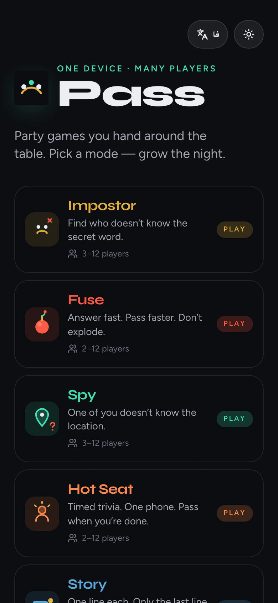
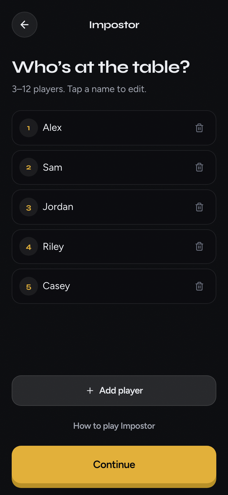
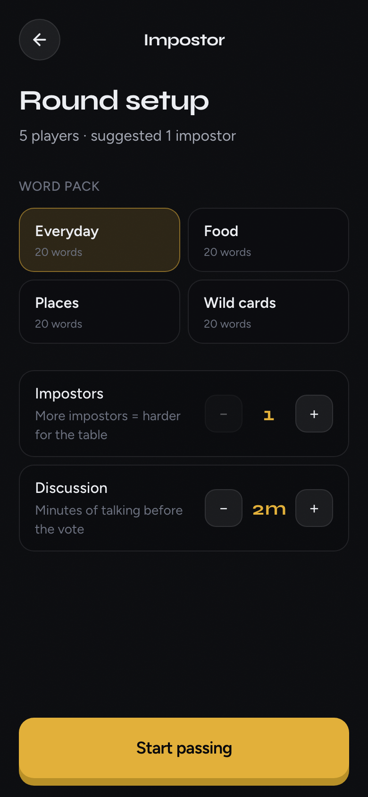
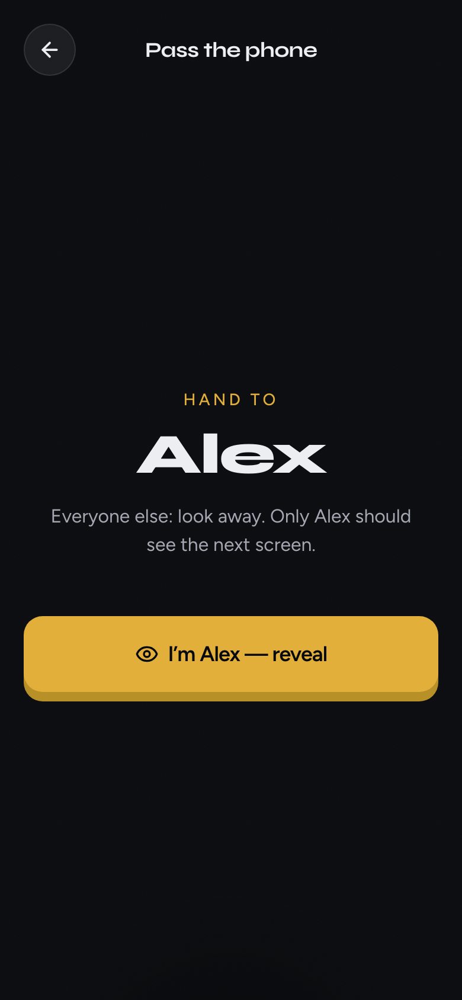
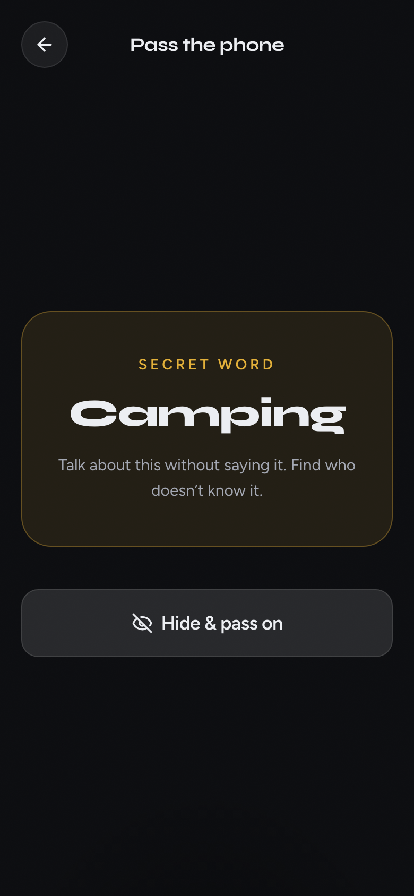
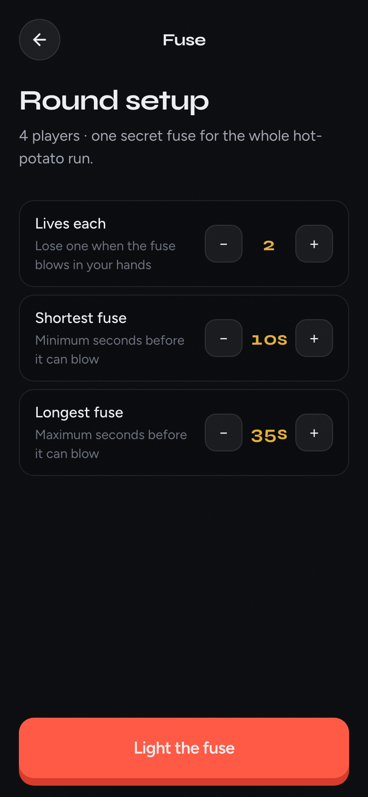
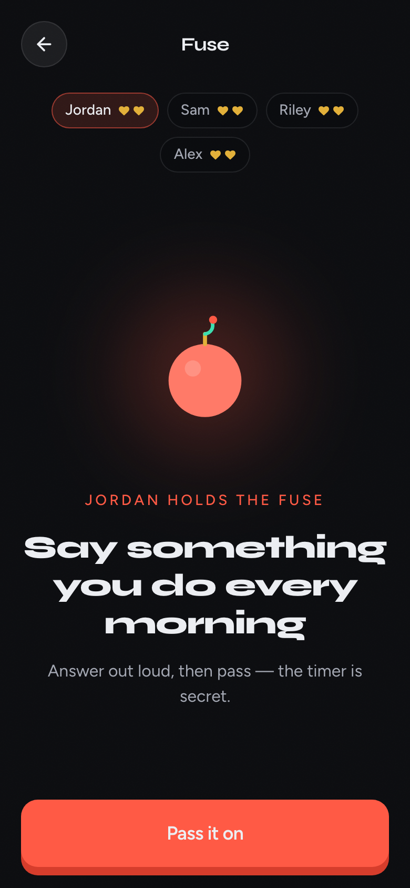

# Pass

Party games for **one shared device** around the table.  
No accounts. No extra phones. Hand it over and play.

<p align="center">
  
</p>

## Games

| Game | Players | Idea |
|------|---------|------|
| **Impostor** | 3–12 | Most players see a secret word. Impostors don’t. Talk, vote, catch them. |
| **Fuse** | 2–12 | A live fuse with a secret timer. Answer the prompt, pass before it blows. |
| **Spy** | 3–12 | Everyone gets a location + role — except the spy. Ask questions, vote them out. |
| **Hot Seat** | 2–12 | Timed multiple-choice trivia. Take turns, highest score wins. |

Built so new games plug into the same lobby — drop a folder under `src/games/` and register it.

---

## Screenshots

### Home
Pick a game and start the night.

<p align="center">
  
</p>

### Impostor

<p align="center">
  
  &nbsp;
  
</p>

<p align="center">
  
  &nbsp;
  
</p>

1. Add everyone at the table  
2. Choose a word pack + impostor count  
3. Pass the phone — each player reveals privately  
4. Discuss, then vote

### Fuse

<p align="center">
  
  &nbsp;
  
</p>

1. Set lives and fuse window  
2. Answer the prompt out loud  
3. Pass it on — when it blows, that player loses a life  
4. Last standing wins

### Spy

1. Choose a location pack + spy count  
2. Pass the phone — crew sees a place + role; spies see only SPY  
3. Ask questions about where you are (don’t say the place)  
4. Vote who the spy is

### Hot Seat

1. Pick a question pack, questions each, and timer  
2. Hand the phone to the player in the seat  
3. Answer before time runs out — correct = +1  
4. Highest score after everyone finishes wins

---

## Quick start

```bash
npm install
npm run dev
```

Open the local URL on a phone or tablet and put it in the middle of the table.

```bash
npm run build
npm run preview
```

---

## Stack

- Vite + React + TypeScript  
- Tailwind CSS v4  
- Zustand (session + per-game state)  
- Motion (screen transitions)

### Expand with a new game

1. Create `src/games/<name>/` with `Setup.tsx`, `Play.tsx`, and a store if needed  
2. Add the id to `GameId` in `src/games/types.ts`  
3. Register it in `src/games/registry.ts`

---

## Brand

| Asset | Path |
|-------|------|
| Favicon | [`public/favicon.svg`](public/favicon.svg) |
| App icon | [`public/icon-512.png`](public/icon-512.png) |
| Logo | [`public/logo.png`](public/logo.png) |
| OG image | [`public/og.png`](public/og.png) |

---

## Deploy (Dokploy)

Repo: `https://github.com/amiralibg/pass.git`

1. Create a Dokploy Compose application from that repo  
2. Compose file: `docker-compose.yml`  
3. Domain → Service Name `pass` · Container Port **3000** · Path `/`  
4. Health check path: `/health`

```bash
docker compose up -d --build
```

Files:

- `Dockerfile` — multi-stage Vite build → Node static server (`node:20-alpine` only)
- `server.mjs` — SPA routing, `/health`, asset caching
- `docker-compose.yml` — port 3000, healthcheck, log rotation

---

## License

Private / personal use unless otherwise stated.
